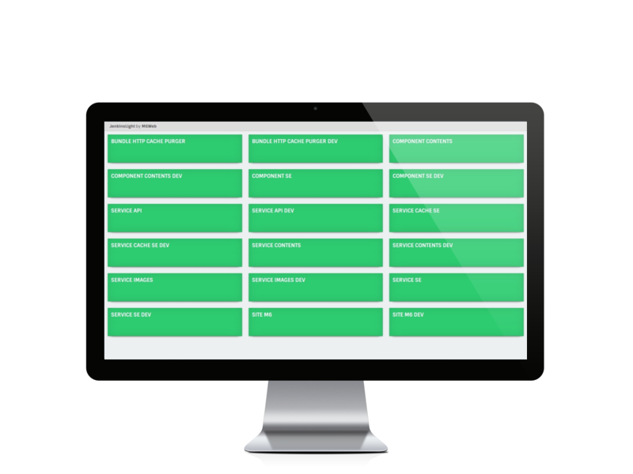

# JenkinsLight

A build monitoring tool (buildwall) that allows you to quickly detect failing projects for Jenkins.



### Requirements

This project required a [cors-plugin Jenkins plugin](https://github.com/jhinrichsen/cors-plugin) to enabled CORS.  
Enabling CORS would let you call the Jenkins REST API from javascript (you can use [the provided packaged plugin](bin/cors.hpi)).

### Installation

```shell
$ git clone git@github.com:M6Web/JenkinsLight.git
$ cd JenkinsLight
$ bower install
```

### Configuration

Please configure a new `js/config.js` file from [`js/config.js.dist`](js/config.js.dist).

| Option | Description |
|--------|-------------|
| JENKINS_URL | Jenkins server url |
| AUTHORIZATION_TOKEN | If your jenkins server is secured, set your authoriaztion token like "Basic 0123456=" (opt.) |
| DEFAULT_JENKINS_VIEW | Default view. Like "All"|
| JOBS_TO_BE_DISPLAYED | Array of all jobs types that can be displayed |
| DEFAULT_JOBS_PER_LINE | Default number of jobs per line on a screen |
| REFRESH_TIME | Refresh time |

### Use

Use `view` query parameter for select a Jenkins view.

```
http://jenkins-light-url/index.html#?view=MyView
```

### Credits

Developped by the [Cytron Team](http://cytron.fr/) of [M6 Web](http://tech.m6web.fr/).

### License

[JenkinsLight](https://github.com/M6Web/JenkinsLight) is licensed under the [MIT license](LICENSE).
